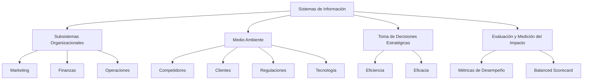

# Unidad 1 - El Rol Estratégico de los Sistemas de Información en las Organizaciones

## Bosquejo Completo de la Unidad

1. **Introducción al Rol Estratégico de los Sistemas de Información**
   - Definición de Sistemas de Información (SI).
   - Importancia de los SI en las organizaciones modernas.
   - Evolución histórica de los SI.

2. **Relación entre los Subsistemas y el Medio Ambiente**
   - Análisis de los subsistemas organizacionales.
   - Interacción entre los SI y el entorno externo.
   - Impacto de las tecnologías de la información en la adaptación al medio ambiente.

3. **Fundamentos Teóricos**
   - Teoría de Sistemas y su aplicación en los SI.
   - Enfoque holístico de la organización.
   - Relación entre los SI y la toma de decisiones estratégicas.

4. **Aplicaciones Prácticas**
   - Casos de estudio de implementación exitosa de SI.
   - Análisis de fallas comunes en la implementación de SI.
   - Herramientas y tecnologías utilizadas en los SI.

5. **Evaluación y Medición del Impacto de los SI**
   - Métricas de desempeño de los SI.
   - Impacto de los SI en la eficiencia y eficacia organizacional.
   - Balanced Scorecard aplicado a los SI.

---

## Conceptos Fundamentales

- **Sistemas de Información (SI)**: Conjunto de componentes interrelacionados que recolectan, procesan, almacenan y distribuyen información para apoyar la toma de decisiones y el control en una organización.
- **Subsistemas Organizacionales**: Divisiones funcionales dentro de una organización (ej: marketing, finanzas, operaciones) que interactúan entre sí y con el entorno.
- **Medio Ambiente**: Factores externos que influyen en la organización, como competidores, clientes, regulaciones y tecnología.
- **Teoría de Sistemas**: Enfoque que considera a la organización como un sistema compuesto por partes interrelacionadas que trabajan hacia un objetivo común.

---

## Conceptos Clave

- **Integración de Sistemas**: Proceso de combinar diferentes subsistemas para que funcionen como un todo unificado.
- **Toma de Decisiones Estratégicas**: Proceso de seleccionar entre varias alternativas para alcanzar los objetivos organizacionales.
- **Eficiencia vs. Eficacia**: La eficiencia se refiere a hacer las cosas correctamente, mientras que la eficacia se refiere a hacer las cosas correctas.

---

## Referencias Cruzadas

- **Relación con la Unidad 2**: El impacto de las tecnologías de la información en las organizaciones.
- **Relación con la Unidad 3**: Las estrategias empresariales y las TICs.
- **Relación con la Unidad 4**: La relación entre las estructuras organizacionales y las TICs.

---

## Notas de Clases

- **Importancia de los SI**: Los SI no solo son herramientas tecnológicas, sino que son fundamentales para la estrategia empresarial.
- **Enfoque Holístico**: Es crucial entender la organización como un sistema integrado donde los SI juegan un papel central.
- **Adaptación al Cambio**: Los SI deben ser flexibles para adaptarse a los cambios en el entorno empresarial.

---

## Descripciones

- **Sistemas de Información Estratégicos**: Aquellos que tienen un impacto significativo en la ventaja competitiva de la organización.
- **Subsistemas y SI**: Cada subsistema (marketing, finanzas, etc.) tiene sus propios SI que deben integrarse para una operación eficiente.

---

## Citas Bibliográficas

- **Kast y Rosenzweig**: "Administración de las Organizaciones", Mc Graw-Hill, Buenos Aires 1985.
- **Jean Paul Sallenave**: "Gerencia y Planeación Estratégica", Norma, Bogotá 1993.
- **R. Kaplan y D. Norton**: "Cuadro de mando integral", Ed. Gestión 2000, Barcelona 2010.

---

## Referencias a Sitios de Influencia

- **Harvard Business Review**: [Enlace](https://hbr.es/)
- **MIT Sloan Management Review**: [Enlace](https://sloanreview.mit.edu/es/)
- **IE Business School Insights**: [Enlace](https://www.ie.edu/insights/)

---

## Resumen Completo de la Unidad

La Unidad 5 se centra en el rol estratégico de los Sistemas de Información (SI) en las organizaciones. Se aborda la importancia de los SI en la toma de decisiones estratégicas y su impacto en la eficiencia y eficacia organizacional. Se analiza la relación entre los subsistemas organizacionales y el medio ambiente, destacando la necesidad de una integración efectiva de los SI para adaptarse a los cambios del entorno. Se presentan casos de estudio y herramientas prácticas para la implementación y evaluación de los SI.

---

## Mapa Conceptual

---
---

# Reingeniería de Procesos - Parte 2

## Metodología para Aplicar la Reingeniería

### Marco Conceptual

- **Análisis de la Situación Actual (As-Is)**: Relevar y analizar los procesos actuales para identificar oportunidades de mejora.
- **Diseño de la Situación Futura (To-Be)**: Diseñar los procesos futuros.
- **Análisis Económico, Financiero y Plan de Implementación**: Construir un plan de trabajo que viabilice la implementación de las mejoras diseñadas.

---

## Etapas Principales del Proyecto de Reingeniería

### 1. Análisis de la Situación Actual (As-Is)

- **Mapeo de procesos**: Documentar los procesos actuales para entender cómo funcionan.
- **Identificación de oportunidades de mejora**: Detectar áreas donde se pueden realizar mejoras significativas.

### 2. Diseño de la Situación Futura (To-Be)

- **Definición de principios guía**: Establecer los principios que guiarán el rediseño de los procesos.
- **Diseño de nuevos macroprocesos**: Crear procesos más eficientes y efectivos.
- **Identificación de requerimientos tecnológicos**: Determinar qué tecnologías se necesitarán para implementar los nuevos procesos.

### 3. Análisis Económico, Financiero y Plan de Implementación

- **Análisis de brechas (Gap Analysis)**: Identificar las diferencias entre la situación actual y la deseada.
- **Desarrollo de un caso de negocio**: Crear un documento que justifique la inversión en el proyecto de reingeniería.
- **Identificación de recursos requeridos**: Determinar los recursos necesarios (dinero, infraestructura, personas) para implementar los cambios.

---

## Técnicas, Herramientas y Métodos

- **Benchmarking**: Evaluar las mejores prácticas de la industria para identificar oportunidades de mejora.
- **Reutilización de Buenas Prácticas**: Aplicar acciones que han funcionado en contextos similares.
- **Análisis FODA**: Evaluar fortalezas, oportunidades, debilidades y amenazas de la organización.
- **Modelo de las Cinco Fuerzas de Porter**: Analizar la competencia en la industria para entender el entorno competitivo.
- **Análisis de Pareto**: Identificar el 20% de los factores que generan el 80% de los efectos.
- **Análisis Causa-Efecto (Ishikawa)**: Identificar las causas raíz de los problemas mediante un diagrama de espina de pescado.

---

## Análisis Económico y Financiero

- **Matriz de Priorización de Oportunidades**: Evaluar oportunidades en función de beneficios y costos.
- **Caso de Negocio**: Herramienta para cuantificar el impacto financiero de las decisiones.
- **Escenarios**: Identificar riesgos y problemas potenciales mediante la creación de diferentes escenarios futuros.

---

## Diseño de la Situación Futura (To-Be Analysis)

- **Planificación para la Implementación**: Identificar inconvenientes y restricciones que puedan afectar la implementación del proyecto.
- **Caso de Negocio**: Resumir la información principal para la toma de decisiones, incluyendo conclusiones, recomendaciones y un plan de acción.

---

Este documento proporciona una visión detallada de la metodología para aplicar la reingeniería de procesos, incluyendo las etapas principales, técnicas y herramientas utilizadas, así como el análisis económico y financiero necesario para la toma de decisiones. Si necesitas más detalles o ajustes, ¡no dudes en pedírmelo! 😊

---
---
# Reingeniería de Procesos - Parte 3

## Caso de Negocio (Business Case)

### ¿Cómo se Desarrolla?

1. **Determinar el Enfoque**:
   - **Objetivos**: Definir los objetivos del proyecto.
   - **Estructura**: Establecer la estructura del caso de negocio.
   - **Audiencia**: Identificar a quién va dirigido el caso de negocio.

2. **Desarrollar Supuestos de Trabajo**:
   - **Alcance**: Definir el alcance del proyecto.
   - **Predecir**: Anticipar posibles resultados.
   - **Simplificar**: Simplificar los supuestos para facilitar el análisis.
   - **Clarificar**: Asegurar que los supuestos sean claros y comprensibles.

3. **Determinar los Beneficios**:
   - **Mejora en los ingresos**: Identificar cómo el proyecto aumentará los ingresos.
   - **Reducción de costos**: Determinar cómo se reducirán los costos.
   - **Incrementar la eficiencia del capital**: Evaluar cómo se optimizará el uso del capital.

4. **Determinar los Costos**:
   - **Gastos operativos**: Identificar los costos operativos asociados al proyecto.
   - **Gastos de capital (inversiones)**: Determinar las inversiones necesarias.

5. **Calcular Impacto Financiero**:
   - **Flujo de caja**: Analizar el flujo de caja esperado.
   - **Valor Actual Neto (VAN)**: Calcular el VAN para evaluar la viabilidad del proyecto.
   - **Tasa Interna de Retorno (TIR)**: Determinar la TIR para evaluar la rentabilidad.
   - **Periodo de repago**: Calcular el tiempo necesario para recuperar la inversión.

6. **Realizar Análisis de Sensibilidad y Riesgos**:
   - **Ajuste o cambios en los supuestos de trabajo**: Evaluar cómo los cambios en los supuestos afectan el proyecto.
   - **Análisis de riesgos**: Identificar y evaluar los riesgos asociados.
   - **Escenarios alternativos**: Crear diferentes escenarios para entender los posibles resultados.

7. **Determinar Impactos No Financieros**:
   - **Matriz de decisión**: Utilizar una matriz para evaluar impactos no financieros.
   - **Descripción cualitativa**: Describir los impactos no financieros de manera cualitativa.

8. **Informe Final y Resumen Ejecutivo**:
   - **Conclusiones**: Resumir las conclusiones del análisis.
   - **Recomendaciones**: Proponer recomendaciones basadas en los hallazgos.
   - **Plan de acción**: Definir un plan de acción para implementar las recomendaciones.

---

## BPO (Business Process Outsourcing)

### Definición
- **BPO**: Subcontratación de funciones del proceso de negocio en proveedores de servicios, ya sea internos o externos a la empresa.

### Beneficios
- **Aumento de la eficacia y la eficiencia**: Mejora en la ejecución de procesos.
- **Mejora continua más coherente**: Implementación de mejores prácticas.
- **Enfoque en la innovación**: Liberar recursos para enfocarse en la innovación.
- **Mejor control y visibilidad**: Mayor transparencia en los procesos.
- **Flexibilidad y escalabilidad**: Adaptabilidad a cambios en la demanda.
- **Libertad para concentrarse en lo esencial**: Enfocarse en actividades estratégicas.

### Principales Empresas de BPO
- **Accenture**: Tecnología de la información y servicios de procesamiento de negocios.
- **Cognizant**: Soluciones digitales en operaciones comerciales, consultoría y tecnología.
- **Concentric**: Soluciones en sectores como automotriz, salud, finanzas y comercio electrónico.
- **DOXA Talent®**: Apoya a pequeñas y medianas empresas.
- **Wipro**: Soporte a empresas en sectores como banca, comercio minorista, viajes y educación.
- **Genpact**: Soluciones digitales basadas en inteligencia artificial.
- **EXL Service**: Soluciones en seguros, atención médica, banca y logística.
- **Teleperformance**: Servicios de atención al cliente.

### Pasos para Implementar BPO

1. **Ámbito**:
   - **Objetivos de negocio**: Definir los objetivos del BPO.
   - **Participantes**: Identificar a los participantes clave.
   - **Problemas clave**: Reconocer los problemas principales.
   - **Alcance inicial y restricciones**: Establecer el alcance y las restricciones.
   - **Implicaciones de recursos humanos**: Considerar el impacto en los recursos humanos.
   - **Requisitos de servicio de alto nivel**: Definir los requisitos de servicio.

2. **Viabilidad**:
   - **Refinamiento del alcance**: Ajustar el alcance del proyecto.
   - **Caso de beneficios**: Desarrollar un caso de beneficios.
   - **Marco comercial**: Establecer el marco comercial.
   - **Gestión de riesgos**: Identificar y gestionar riesgos.
   - **Enfoque de recursos humanos**: Definir el enfoque de recursos humanos.
   - **Parámetros de servicio**: Establecer los parámetros de servicio.

3. **Preparación**:
   - **Debida diligencia**: Realizar un análisis detallado.
   - **Definición del servicio**: Definir los servicios a externalizar.
   - **Preparaciones de recursos humanos**: Preparar al personal para la transición.
   - **Preparación del contrato**: Elaborar el contrato de BPO.
   - **Presupuesto acordado**: Establecer el presupuesto.
   - **Actualización del caso de negocio**: Actualizar el caso de negocio.

4. **Transición**:
   - **Consolidación del servicio**: Consolidar los servicios.
   - **Transferencias de**:
     - **Personal**: Transferir personal.
     - **Responsabilidades**: Transferir responsabilidades.
     - **Activos**: Transferir activos.
   - **Inicio del nuevo servicio**: Iniciar el nuevo servicio.

5. **Entrega**:
   - **Gestión y reporte del servicio**: Gestionar y reportar el servicio.
   - **Realización de beneficios**: Realizar los beneficios esperados.
   - **Mejora continua**: Implementar mejoras continuas.

---

Este documento proporciona una visión detallada del desarrollo de un caso de negocio y la implementación de BPO, incluyendo los pasos clave y las consideraciones necesarias. Si necesitas más detalles o ajustes, ¡no dudes en pedírmelo! 😊

---
---
---