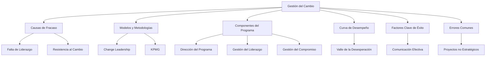

# Gestión del Cambio en las Organizaciones

## Bosquejo Completo de la Unidad

1. **Introducción a la Gestión del Cambio**
   - Definición y objetivos de la gestión del cambio.
   - Importancia de la gestión del cambio en las organizaciones modernas.
   - Diferencias entre cambio y transformación.

2. **Causas y Fracasos en los Proyectos de Cambio**
   - Principales causas de fracaso en los procesos de cambio.
   - Estadísticas y análisis de fracasos en proyectos de cambio.
   - Factores humanos y técnicos que influyen en el éxito o fracaso.

3. **Modelos y Metodologías de Gestión del Cambio**
   - Modelo de Change Leadership (Ernst & Young).
   - Modelo de KPMG.
   - Metodologías de soporte al cambio, preparación y transformación, y generación de liderazgo.

4. **Componentes del Programa de Cambio**
   - Dirección del programa.
   - Gestión del liderazgo.
   - Gestión del compromiso.
   - Alineamiento cultural y organizacional.

5. **Curva de Desempeño y Fases del Cambio**
   - Curva de desempeño: visualizar el cambio como un proceso.
   - Fases del cambio: negación, resistencia, aceptación, compromiso.
   - El "valle de la desesperación" y cómo superarlo.

6. **Factores Clave de Éxito en la Gestión del Cambio**
   - Generar sensación de urgencia.
   - Crear una coalición que lidere la iniciativa.
   - Comunicar la visión y eliminar obstáculos.
   - Planificar y obtener logros rápidos.

7. **Errores Comunes en la Gestión del Cambio**
   - Proyectos no ligados a la estrategia de la organización.
   - Falta de liderazgo y resultados mensurables.
   - Miedo a lo desconocido y falta de flexibilidad.

8. **Herramientas y Técnicas para la Gestión del Cambio**
   - Comunicación efectiva.
   - Capacitación y desarrollo de habilidades.
   - Análisis de impacto y planes de mitigación.

---

## Conceptos Fundamentales

- **Gestión del Cambio**: Conjunto de procesos, herramientas y técnicas que gestionan los aspectos humanos para asegurar que los cambios significativos se lleven a cabo de manera ordenada, controlada y sistemática.
- **Curva de Desempeño**: Representación gráfica de cómo el desempeño de las personas y la organización varía durante un proceso de cambio.
- **Resistencia al Cambio**: Reacción natural de las personas ante cambios que perciben como amenazas a su estabilidad o rutina.

---

## Conceptos Clave

- **Cambio vs. Transformación**: El cambio es un evento específico, mientras que la transformación es un proceso continuo que redefine la organización.
- **Liderazgo en el Cambio**: Rol crucial de los líderes para guiar, comunicar y sostener el cambio en la organización.
- **Compromiso**: Adhesión de los individuos al cambio, clave para su éxito.

---

## Referencias Cruzadas

- **Relación con la Unidad 2**: El impacto de las tecnologías de la información en las organizaciones.
- **Relación con la Unidad 3**: Las estrategias empresariales y las TICs.
- **Relación con la Unidad 4**: La relación entre las estructuras organizacionales y las TICs.

---

## Notas de Clases

- **Importancia del Liderazgo**: Los líderes deben transmitir una visión clara y crear un sentido de urgencia para el cambio.
- **Comunicación Efectiva**: La comunicación debe ser oportuna, veraz y permanente durante todo el proceso de cambio.
- **Resistencia al Cambio**: Las resistencias son valiosas y deben ser escuchadas, ya que proporcionan información clave para ajustar el proceso.

---

## Descripciones

- **Curva de Desempeño**: Visualiza cómo el desempeño de las personas y la organización cae inicialmente durante el cambio (el "valle de la desesperación") y luego se recupera si el cambio es gestionado adecuadamente.
- **Componentes del Programa de Cambio**: Incluyen la dirección del programa, la gestión del liderazgo, el compromiso y el alineamiento cultural.

---

## Citas Bibliográficas

- **Charles Darwin**: "No es la especie más fuerte la que sobrevive, ni la más inteligente, sino la que responde mejor al cambio."
- **Michael Hammer y James Champy**: "Reengineering the Corporation" (1993).
- **Peter Drucker**: "The Effective Executive" (1967).
- **John Kotter**: "Leading Change" (1996).
- **William Bridges**: "Managing Transitions: Making the Most of Change" (1991).

---

## Referencias a Sitios de Influencia

### Publicaciones y Sitios Web
- **Harvard Business Review (HBR)**: [Enlace](https://hbr.org/)
  - Artículos sobre gestión del cambio, liderazgo y transformación organizacional.
- **MIT Sloan Management Review**: [Enlace](https://sloanreview.mit.edu/)
  - Publicaciones sobre innovación, gestión del cambio y estrategia empresarial.
- **McKinsey & Company**: [Enlace](https://www.mckinsey.com/)
  - Informes y artículos sobre transformación digital y gestión del cambio.
- **PMI (Project Management Institute)**: [Enlace](https://www.pmi.org/)
  - Recursos sobre gestión de proyectos y cambio organizacional.

### Canales de YouTube
- **Harvard Business Review**: [Enlace](https://www.youtube.com/user/HarvardBusiness)
  - Contenido sobre liderazgo, gestión del cambio y estrategia empresarial.
- **MIT Sloan Management Review**: [Enlace](https://www.youtube.com/user/MITSloanManagement)
  - Videos sobre innovación y gestión del cambio.
- **GaryVee**: [Enlace](https://www.youtube.com/user/GaryVaynerchuk)
  - Enfoque práctico sobre liderazgo y adaptación al cambio.
- **Simon Sinek**: [Enlace](https://www.youtube.com/user/SimonSinek)
  - Contenido inspirador sobre liderazgo y gestión del cambio.

### Profesionales de Influencia
- **John Kotter**: Experto en liderazgo y gestión del cambio, autor de "Leading Change".
- **William Bridges**: Autor de "Managing Transitions", especializado en transiciones y cambio organizacional.
- **Michael Hammer y James Champy**: Autores de "Reengineering the Corporation", pioneros en reingeniería de procesos.
- **Peter Drucker**: Considerado el padre de la gestión moderna, autor de "The Effective Executive".

---

## Resumen Completo de la Unidad

La **Gestión del Cambio** es un proceso crítico para asegurar que las organizaciones puedan adaptarse a nuevos entornos, tecnologías y estrategias. Implica gestionar los aspectos humanos del cambio, desde la resistencia inicial hasta la aceptación y el compromiso. Los líderes juegan un papel crucial en este proceso, comunicando la visión y guiando a la organización a través de las fases del cambio. Las metodologías y herramientas, como la curva de desempeño y los modelos de Change Leadership, son esenciales para gestionar el cambio de manera efectiva. Los errores comunes, como la falta de liderazgo y la comunicación deficiente, deben ser evitados para asegurar el éxito del cambio.

---

## Mapa Conceptual

