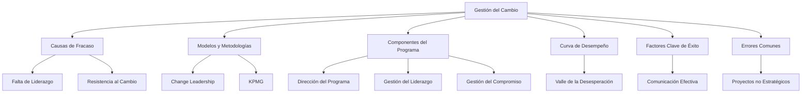

# Management del Área IT

## Bosquejo Completo de la Unidad

1. **Introducción al Management del Área IT**
   - Definición y objetivos del management del área IT.
   - Importancia de la gestión de TI en las organizaciones modernas.
   - Diferencias entre gestión de TI y gobierno de TI.

2. **Conectando TI con el Negocio**
   - Desafíos en la alineación de TI con los objetivos del negocio.
   - Estrategias para mejorar la conexión entre TI y el negocio.
   - Modelos de gestión de relaciones entre TI y el negocio.

3. **Modelos y Frameworks de Gestión de TI**
   - ITIL (Information Technology Infrastructure Library).
   - COBIT (Control Objectives for Information and Related Technologies).
   - TOGAF (The Open Group Architecture Framework).
   - ISO 27001 (Gestión de la Seguridad de la Información).

4. **Componentes Clave del Management de TI**
   - Liderazgo en TI.
   - Gestión de la relación con el cliente.
   - Entrega de soluciones de negocio.
   - Gestión de servicios.
   - Operaciones de TI.

5. **Modelos de Madurez en la Gestión de TI**
   - Definición y beneficios de los modelos de madurez.
   - Modelos de madurez más utilizados (Gartner, CMMI, etc.).
   - Aplicación de modelos de madurez en la gestión de TI.

6. **Gestión de Servicios de TI**
   - Servicios básicos, a demanda y adicionales.
   - Procesos de gestión de servicios de TI.
   - Mejores prácticas en la gestión de servicios de TI.

7. **Factores Clave de Éxito en la Gestión de TI**
   - Generación de valor a través de la gestión de TI.
   - Alineación de iniciativas de TI con los objetivos del negocio.
   - Gestión de riesgos y cumplimiento normativo.

8. **Errores Comunes en la Gestión de TI**
   - Falta de alineación con la estrategia del negocio.
   - Gestión deficiente de proyectos de TI.
   - Resistencia al cambio y falta de liderazgo.

---

## Conceptos Fundamentales

- **Gestión de TI**: Conjunto de procesos, herramientas y técnicas para gestionar los recursos y servicios de TI de manera eficiente y efectiva.
- **Gobierno de TI**: Estructura que asegura que las TI respalden los objetivos empresariales y cumplan con las regulaciones y estándares.
- **Alineación de TI con el Negocio**: Proceso de asegurar que las iniciativas de TI estén alineadas con los objetivos estratégicos del negocio.

---

## Conceptos Clave

- **ITIL**: Marco de buenas prácticas para la gestión de servicios de TI, enfocado en la mejora continua y la alineación con los objetivos del negocio.
- **COBIT**: Marco de gobierno de TI que proporciona un conjunto de controles y objetivos para la gestión efectiva de TI.
- **TOGAF**: Marco de arquitectura empresarial que facilita la alineación de la arquitectura de TI con los objetivos estratégicos de la organización.
- **ISO 27001**: Estándar internacional para la gestión de la seguridad de la información.

---

## Referencias Cruzadas

- **Relación con la Unidad 2**: El impacto de las tecnologías de la información en las organizaciones.
- **Relación con la Unidad 3**: Las estrategias empresariales y las TICs.
- **Relación con la Unidad 4**: La relación entre las estructuras organizacionales y las TICs.

---

## Notas de Clases

- **Importancia del Liderazgo en TI**: Los líderes de TI deben transmitir una visión clara y crear un sentido de urgencia para el cambio.
- **Comunicación Efectiva**: La comunicación debe ser oportuna, veraz y permanente durante todo el proceso de gestión de TI.
- **Resistencia al Cambio**: Las resistencias son valiosas y deben ser escuchadas, ya que proporcionan información clave para ajustar el proceso.

---

## Descripciones

- **Curva de Desempeño**: Visualiza cómo el desempeño de las personas y la organización cae inicialmente durante el cambio (el "valle de la desesperación") y luego se recupera si el cambio es gestionado adecuadamente.
- **Componentes del Programa de Cambio**: Incluyen la dirección del programa, la gestión del liderazgo, el compromiso y el alineamiento cultural.

---

## Citas Bibliográficas

- **Charles Darwin**: "No es la especie más fuerte la que sobreviva, ni la más inteligente, sino la que responde mejor al cambio."
- **Michael Hammer y James Champy**: "Reengineering the Corporation" (1993).
- **Peter Drucker**: "The Effective Executive" (1967).
- **John Kotter**: "Leading Change" (1996).
- **William Bridges**: "Managing Transitions: Making the Most of Change" (1991).

---

## Referencias a Sitios de Influencia

### Publicaciones y Sitios Web
- **Harvard Business Review (HBR)**: [Enlace](https://hbr.org/)
  - Artículos sobre gestión del cambio, liderazgo y transformación organizacional.
- **MIT Sloan Management Review**: [Enlace](https://sloanreview.mit.edu/)
  - Publicaciones sobre innovación, gestión del cambio y estrategia empresarial.
- **McKinsey & Company**: [Enlace](https://www.mckinsey.com/)
  - Informes y artículos sobre transformación digital y gestión del cambio.
- **PMI (Project Management Institute)**: [Enlace](https://www.pmi.org/)
  - Recursos sobre gestión de proyectos y cambio organizacional.

### Canales de YouTube
- **Harvard Business Review**: [Enlace](https://www.youtube.com/user/HarvardBusiness)
  - Contenido sobre liderazgo, gestión del cambio y estrategia empresarial.
- **MIT Sloan Management Review**: [Enlace](https://www.youtube.com/user/MITSloanManagement)
  - Videos sobre innovación y gestión del cambio.
- **GaryVee**: [Enlace](https://www.youtube.com/user/GaryVaynerchuk)
  - Enfoque práctico sobre liderazgo y adaptación al cambio.
- **Simon Sinek**: [Enlace](https://www.youtube.com/user/SimonSinek)
  - Contenido inspirador sobre liderazgo y gestión del cambio.

### Profesionales de Influencia
- **John Kotter**: Experto en liderazgo y gestión del cambio, autor de "Leading Change".
- **William Bridges**: Autor de "Managing Transitions", especializado en transiciones y cambio organizacional.
- **Michael Hammer y James Champy**: Autores de "Reengineering the Corporation", pioneros en reingeniería de procesos.
- **Peter Drucker**: Considerado el padre de la gestión moderna, autor de "The Effective Executive".

---

## Resumen Completo de la Unidad

El **Management del Área IT** es un proceso crítico para asegurar que las organizaciones puedan adaptarse a nuevos entornos, tecnologías y estrategias. Implica gestionar los aspectos humanos del cambio, desde la resistencia inicial hasta la aceptación y el compromiso. Los líderes juegan un papel crucial en este proceso, comunicando la visión y guiando a la organización a través de las fases del cambio. Las metodologías y herramientas, como la curva de desempeño y los modelos de Change Leadership, son esenciales para gestionar el cambio de manera efectiva. Los errores comunes, como la falta de liderazgo y la comunicación deficiente, deben ser evitados para asegurar el éxito del cambio.

---

## Mapa Conceptual

