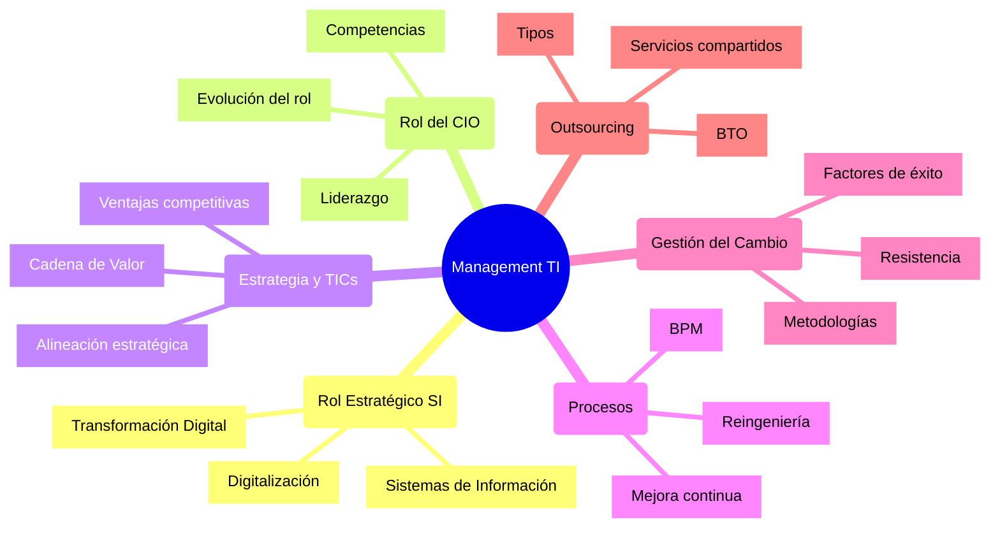

# Guía de Estudio: Management de TI para CIOs

## 1. Mapa Conceptual General del Curso



## 2. Conceptos Fundamentales por Unidad

### Unidad 1: Rol Estratégico de SI
- **Concepto Clave**: Los SI son habilitadores estratégicos que transforman la organización
- **Elementos principales**:
  - Transformación Digital
  - Digitalización de procesos
  - Digitalización organizacional
- **Framework de análisis**:
  - Estructura organizacional
  - Cultura organizacional
  - Procesos de negocio

### Unidad 2: Rol del CIO
- **Evolución del rol**:
  1. Gestor de Tecnología (1960s-1980s)
  2. Gestor de Recursos de Información (1980s-2000s)
  3. Socio Estratégico (2000s-2010s)
  4. Líder de Transformación Digital (2010s-presente)
- **Competencias clave**:
  - Liderazgo estratégico
  - Gestión del cambio
  - Innovación tecnológica
  - Alineación negocio-TI

### Unidad 3: Estrategias Empresariales y TICs
- **Modelos de análisis**:
  - Cadena de Valor de Porter
  - Modelo de las 5 Fuerzas
  - Análisis FODA
- **Elementos estratégicos**:
  - Ventajas competitivas
  - Alineación estratégica
  - Innovación tecnológica

## 3. Técnicas de Estudio Recomendadas

### Método Cornell para Toma de Notas
```
|--------------------|---------------------|
| Concepto/Pregunta  | Notas Detalladas   |
|--------------------|---------------------|
| ¿Cuál es el rol   | - Habilitador      |
| estratégico del   | - Transformador    |
| CIO moderno?      | - Líder digital    |
|--------------------|---------------------|
| Resumen: El CIO debe actuar como líder  |
| transformacional que alinea TI-Negocio  |
|--------------------|---------------------|
```

### Mapas Mentales por Unidad
- Usar colores diferentes para cada rama principal
- Conectar conceptos relacionados entre unidades
- Incluir ejemplos prácticos y casos de estudio

### Técnica Pomodoro para el Estudio
1. 25 minutos de estudio enfocado
2. 5 minutos de descanso
3. Después de 4 ciclos, descanso más largo
4. Repasar conceptos clave durante los descansos

## 4. Conexiones Conceptuales Importantes

### Transformación Digital y Gestión del Cambio
- La transformación digital requiere una gestión efectiva del cambio
- El CIO debe liderar ambos aspectos
- La resistencia al cambio es un desafío común

### Procesos y Estrategia
- BPM como herramienta de ejecución estratégica
- Reingeniería para transformación radical
- Mejora continua para optimización incremental

### Outsourcing y Servicios
- BTO como enabler de transformación
- Centros de servicios compartidos
- Gestión de proveedores y partnerships

## 5. Preguntas de Autoevaluación

1. ¿Cómo ha evolucionado el rol del CIO y por qué?
2. ¿Qué diferencia hay entre digitalización y transformación digital?
3. ¿Cómo se alinean las TICs con la estrategia empresarial?
4. ¿Cuáles son los factores clave de éxito en la gestión del cambio?
5. ¿Qué tipos de outsourcing existen y cuándo usar cada uno?

## 6. Casos de Estudio Relevantes

### Transformación Digital
- Caso Netflix: De DVD por correo a streaming global
- Lecciones aprendidas:
  * Importancia de la visión estratégica
  * Gestión del cambio efectiva
  * Innovación continua

### Reingeniería de Procesos
- Caso Amazon: Automatización de almacenes
- Aprendizajes:
  * Integración tecnología-procesos
  * Mejora de eficiencia operativa
  * Impacto en la cadena de valor

## 7. Framework de Preparación para Exámenes

### Método STAR para Análisis de Casos
- **Situación**: Contexto y antecedentes
- **Tarea**: Objetivo a lograr
- **Acción**: Pasos implementados
- **Resultado**: Impacto y aprendizajes

### Checklist de Conceptos Clave
- [ ] Rol estratégico de SI
- [ ] Evolución del CIO
- [ ] Frameworks de gestión (ITIL, COBIT)
- [ ] Gestión del cambio
- [ ] BPM y reingeniería
- [ ] Outsourcing y BTO

## 8. Recursos Complementarios

### Bibliografía Esencial
1. "Leading Digital" por George Westerman
2. "IT Strategy" por Jim McKeen
3. "The CIO Edge" por Graham Waller

### Recursos Online
- Harvard Business Review - Sección TI
- MIT Sloan Management Review
- Gartner Research Papers

## 9. Tips para el Éxito

1. **Enfoque Práctico**
   - Relacionar conceptos con experiencias laborales
   - Buscar ejemplos reales de implementación
   - Practicar con casos de estudio

2. **Desarrollo de Competencias**
   - Habilidades técnicas
   - Habilidades de liderazgo
   - Gestión del cambio
   - Comunicación efectiva

3. **Preparación para Evaluaciones**
   - Repasar mapas conceptuales
   - Resolver casos prácticos
   - Discutir con compañeros
   - Crear resúmenes ejecutivos

## 10. Plantilla de Estudio Diario

```markdown
Fecha: [DD/MM/YYYY]
Unidad: [Número y Título]

1. Conceptos principales revisados:
   - 
   - 
   
2. Dudas/Preguntas:
   -
   -

3. Conexiones con otras unidades:
   -
   -

4. Casos prácticos analizados:
   -
   -

5. Plan de repaso:
   -
   -
```

