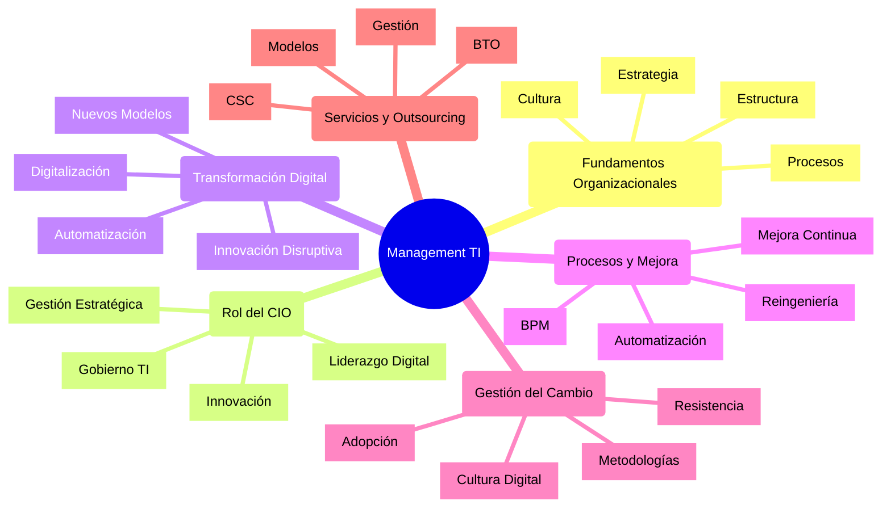
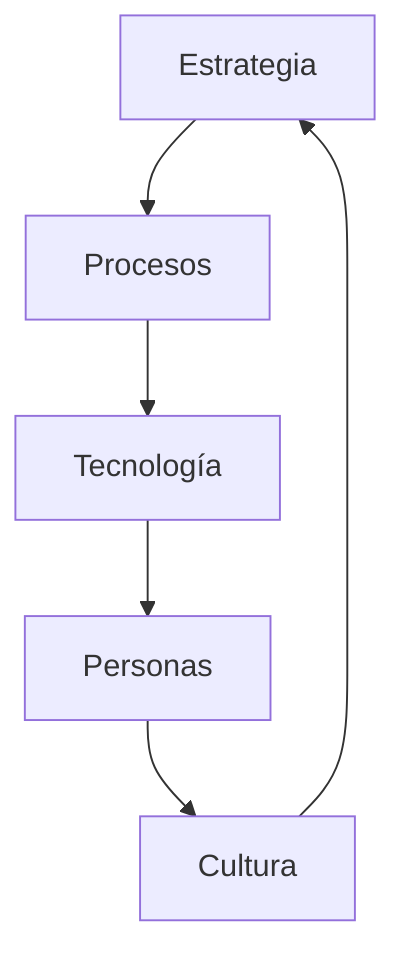

# Guía Integral de Estudio: Management de TI y Rol del CIO

## 1. Estructura General del Curso

### Mapa Mental Integrado


## 2. Análisis Detallado por Unidad

### Unidad 1: Fundamentos y Rol Estratégico

#### A. Marco Conceptual Organizacional
1. **Estructura Organizacional**
   - Jerarquía y roles
   - Coordinación
   - Departamentalización
   - Formalización

2. **Cultura Organizacional**
   - Valores
   - Creencias compartidas
   - Prácticas organizacionales
   - Transformación cultural

3. **Procesos Core**
   - Operativos
   - Estratégicos
   - Soporte
   - Innovación

#### B. Sistemas de Información
1. **Perspectiva Estratégica**
   ```
   ┌─────────────────────┐
   │  Nivel Estratégico  │
   ├─────────────────────┤
   │  Nivel Táctico      │
   ├─────────────────────┤
   │  Nivel Operativo    │
   └─────────────────────┘
   ```

2. **Impacto en la Organización**
   - Eficiencia operacional
   - Ventaja competitiva
   - Innovación
   - Transformación digital

### Unidad 2: Rol del CIO Moderno

#### A. Evolución del Rol
```
Era 1 (1960-1980)  │ Era 2 (1980-2000)  │ Era 3 (2000-2010)  │ Era 4 (2010+)
─────────────────────────────────────────────────────────────────────────────
Gestor Tecnológico │ Gestor Información │ Socio Estratégico  │ Líder Digital
```

#### B. Competencias Clave del CIO
1. **Liderazgo Estratégico**
   - Visión tecnológica
   - Alineación negocio-TI
   - Gestión del cambio
   - Innovación

2. **Habilidades Gerenciales**
   - Gestión de equipos
   - Comunicación efectiva
   - Negociación
   - Gestión de stakeholders

3. **Conocimiento Técnico**
   - Arquitectura empresarial
   - Seguridad informática
   - Cloud computing
   - Tecnologías emergentes

### Unidad 3: Estrategia y Transformación Digital

#### A. Frameworks de Análisis Estratégico
1. **Modelo de Porter**
   ```
   ┌─────────────────────────┐
   │    Nuevos Entrantes     │
   ├─────────┬───────┬───────┤
   │         │       │       │
   │Provee-  │Compe- │Clien- │
   │dores    │tencia │tes    │
   │         │       │       │
   ├─────────┴───────┴───────┤
   │     Sustitutos          │
   └─────────────────────────┘
   ```

2. **Cadena de Valor Digital**
   - Actividades primarias digitalizadas
   - Soporte tecnológico
   - Integración digital
   - Nuevos modelos de negocio

#### B. Transformación Digital
1. **Dimensiones**
   - Procesos
   - Experiencia del cliente
   - Modelo de negocio
   - Cultura organizacional

2. **Etapas de Madurez**
   ```
   Nivel 1 │ Nivel 2  │ Nivel 3   │ Nivel 4    │ Nivel 5
   ────────┼─────────┼───────────┼────────────┼──────────
   Inicial │ Digital  │ Integrado │ Optimizado │ Innovador
   ```

### Unidad 4: Gestión de Procesos y Mejora Continua

#### A. Business Process Management (BPM)
1. **Ciclo de Vida BPM**
   ```mermaid
   graph TD
     A[Diseño] --> B[Modelado]
     B --> C[Ejecución]
     C --> D[Monitoreo]
     D --> E[Optimización]
     E --> A
   ```

2. **Herramientas BPM**
   - BPMN 2.0
   - Automatización
   - Analytics
   - Process Mining

#### B. Reingeniería de Procesos
1. **Metodología**
   - Análisis As-Is
   - Diseño To-Be
   - Gestión del cambio
   - Implementación

2. **Factores de Éxito**
   - Compromiso ejecutivo
   - Gestión del cambio
   - Medición de resultados
   - Capacitación

## 3. Técnicas Avanzadas de Estudio

### A. Método de Casos
1. **Framework STAR Extendido**
   ```
   Situación    │ ¿Cuál era el contexto?
   ─────────────┼───────────────────────
   Tarea        │ ¿Qué había que lograr?
   ─────────────┼───────────────────────
   Acción       │ ¿Qué se hizo?
   ─────────────┼───────────────────────
   Resultado    │ ¿Qué se logró?
   ─────────────┼───────────────────────
   Aprendizaje  │ ¿Qué se aprendió?
   ```

2. **Análisis de Casos Prácticos**
   - Identificación del problema
   - Análisis de alternativas
   - Propuesta de solución
   - Plan de implementación

### B. Mapa de Conceptos Integrado


## 4. Herramientas de Evaluación

### A. Rúbrica de Autoevaluación
```
Nivel     │ Conocimiento │ Aplicación │ Análisis │ Síntesis
──────────┼──────────────┼────────────┼──────────┼──────────
Básico    │     [ ]      │    [ ]     │   [ ]    │   [ ]
──────────┼──────────────┼────────────┼──────────┼──────────
Intermedio│     [ ]      │    [ ]     │   [ ]    │   [ ]
──────────┼──────────────┼────────────┼──────────┼──────────
Avanzado  │     [ ]      │    [ ]     │   [ ]    │   [ ]
```

### B. Preguntas Clave por Unidad
1. **Fundamentos**
   - ¿Cómo impactan los SI en la estructura organizacional?
   - ¿Cuál es el rol de la cultura en la transformación digital?

2. **Rol del CIO**
   - ¿Cómo ha evolucionado el rol del CIO?
   - ¿Qué competencias son críticas para un CIO moderno?

3. **Estrategia**
   - ¿Cómo se alinea TI con la estrategia empresarial?
   - ¿Qué frameworks son más efectivos para el análisis estratégico?

## 5. Plan de Estudio Semanal

### Semana 1: Fundamentos
- Lecturas base
- Casos prácticos
- Mapas conceptuales
- Autoevaluación

### Semana 2: Rol del CIO
- Evolución del rol
- Competencias clave
- Casos de éxito
- Ejercicios prácticos

### Semana 3: Estrategia
- Frameworks
- Transformación digital
- Análisis de casos
- Proyectos

### Semana 4: Integración
- Repaso general
- Casos integradores
- Preparación de presentaciones
- Evaluación final

## 6. Recursos Complementarios

### A. Bibliografía Esencial
1. **Libros Core**
   - "Digital Transformation" - David L. Rogers
   - "Leading Digital" - George Westerman
   - "The CIO Edge" - Graham Waller

2. **Artículos Académicos**
   - Harvard Business Review
   - MIT Sloan Management Review
   - Gartner Research

### B. Recursos Online
1. **Plataformas de Aprendizaje**
   - Coursera: Digital Transformation
   - edX: IT Strategy
   - Udemy: CIO Leadership

2. **Comunidades Profesionales**
   - CIO.com
   - IDG Connect
   - IT Governance Forums

## 7. Plantillas de Trabajo

### A. Análisis de Caso
```markdown
# Análisis de Caso: [Título]

## 1. Contexto
- Empresa:
- Industria:
- Situación inicial:

## 2. Desafíos
- Problema principal:
- Problemas secundarios:
- Restricciones:

## 3. Análisis
- Causas raíz:
- Impactos:
- Stakeholders:

## 4. Solución Propuesta
- Descripción:
- Justificación:
- Plan de implementación:

## 5. Resultados Esperados
- Beneficios:
- Métricas:
- Timeline:
```

### B. Evaluación de Competencias
```markdown
# Evaluación de Competencias CIO

## 1. Liderazgo Estratégico
- [ ] Visión tecnológica
- [ ] Alineación negocio-TI
- [ ] Gestión del cambio

## 2. Habilidades Gerenciales
- [ ] Gestión de equipos
- [ ] Comunicación
- [ ] Negociación

## 3. Conocimiento Técnico
- [ ] Arquitectura
- [ ] Seguridad
- [ ] Innovación
```

## 8. Tips para el Éxito

1. **Preparación Efectiva**
   - Estudiar con casos prácticos
   - Crear mapas mentales
   - Practicar presentaciones
   - Formar grupos de estudio

2. **Durante el Examen**
   - Leer cuidadosamente
   - Priorizar preguntas
   - Gestionar el tiempo
   - Revisar respuestas

3. **Desarrollo Profesional**
   - Networking
   - Certificaciones
   - Actualización constante
   - Participación en comunidades

## 9. Calendario de Preparación

```markdown
Semana 1-2: Fundamentos
- Lectura básica
- Mapas conceptuales
- Casos introductorios

Semana 3-4: Profundización
- Análisis detallado
- Casos complejos
- Ejercicios prácticos

Semana 5-6: Integración
- Repaso general
- Casos integradores
- Simulaciones

Semana 7-8: Preparación Final
- Revisión
- Mock exams
- Feedback
```

## 10. Evaluación Final

### Checklist de Preparación
```markdown
1. Teoría
   [ ] Conceptos fundamentales
   [ ] Frameworks
   [ ] Modelos de análisis

2. Práctica
   [ ] Casos resueltos
   [ ] Ejercicios
   [ ] Proyectos

3. Integración
   [ ] Conexiones entre temas
   [ ] Aplicaciones prácticas
   [ ] Visión general
```

